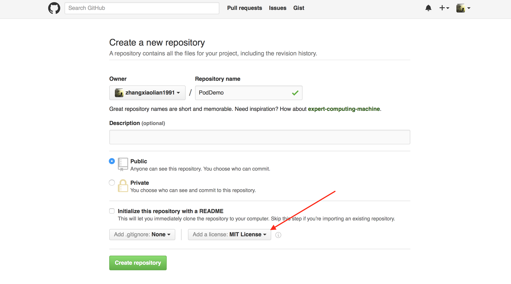
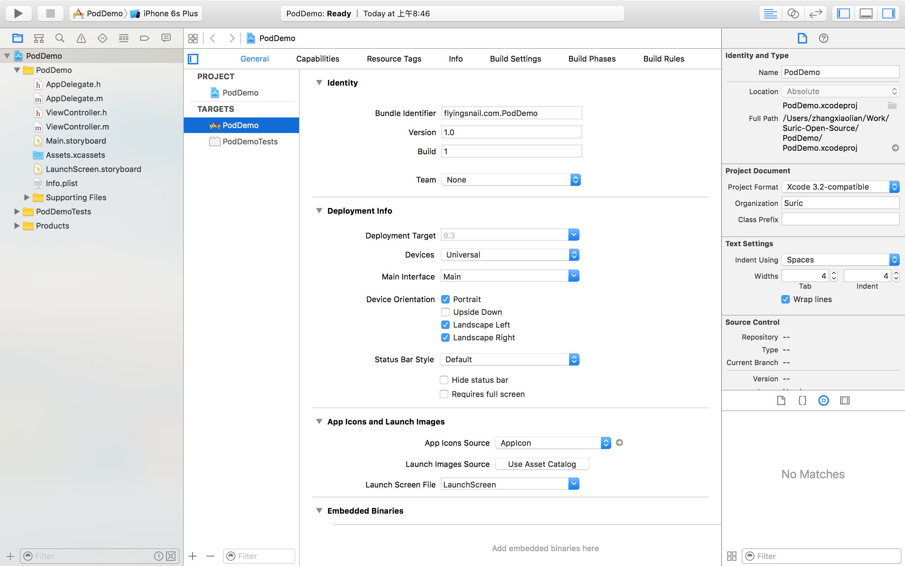
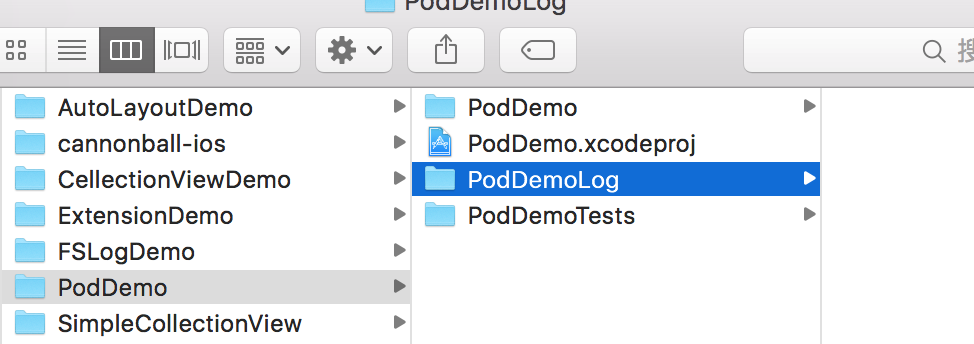
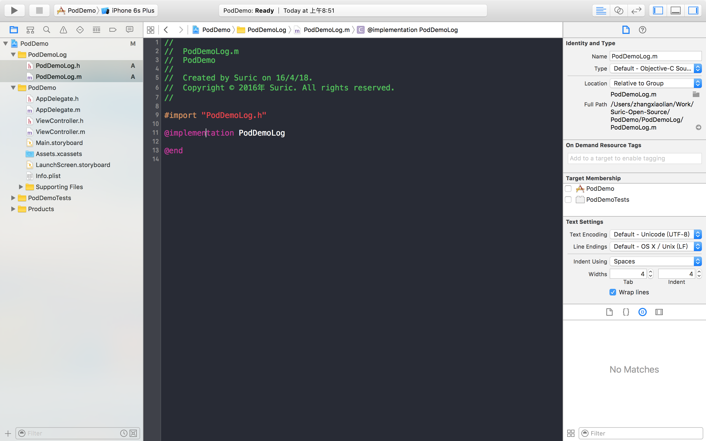

### 快速为自己的库创建 cocoapods

#### 1、在 Github 上创建仓库
直接新建仓库（repo），注意勾选license，如下图

#### 2、Xcode 创建 Demo，并添加自己的库 

此处新建了 PodDemoLog 文件夹，你也可以自己把已经写好的库类拖进工程文件夹

给 PodDemoLog 添加 Class（若是直接拖进来的Class，请忽略此步骤）

#### 3、给本地 Demo 仓库添加第一步在 Github 上创建的远程

进入 PodDemo 工作目录：
  
    $ cd /Users/zhangxiaolian/Work/Suric-Open-Source/PodDemo 

提交本地修改：
    
    $ git add .
    $ git commit -m "some change"   

添加远程仓库：
    
    $ git remote add origin https://github.com/zhangxiaolian1991/PodDemo.git
   
获取 LICENSE：
  
    $ git pull

#### 4、添加 Tag, 并提交到Github
     
     $ git tag 0.0.1
     $ git push --tags
   
#### 5、给本地库创建 .podspec 文件
   
     $ pod spec create PodFastDemo
     
打开 PodDemo.podspec, 做出相应修改：
     
     Pod::Spec.new do |s|
     
     s.name         = "PodFastDemo"
     s.version      = "0.0.1"
     s.summary      = "PodDemo to demo fast way for create self pod"
     s.description  = " demo fast way to create self pod, hope can help you"

     s.homepage     = "https://github.com/zhangxiaolian1991/PodDemo"

     s.license      = { :type => "MIT", :file => "LICENSE" }
     s.author             = { "Suric Zhang" => "372081349@qq.com" }
     s.source       = { :git => "https://github.com/zhangxiaolian1991/PodDemo.git", :tag => "0.0.1" }
     s.source_files  = "PodDemoLog/**/*.{h,m}"
  
    end

验证 .podspec:
     
    $ pod spec lint
    
通过显示如下
     
      ->PodDemo (0.0.1)

     Analyzed 1 podspec.

     PodDemo.podspec passed validation.

#### 6、上传到 CocoaPods
若没有注册过 trunk，请先注册
    
    $ pod trunk register 你的邮箱 '用户名' --description='简单描述'
        
上传到 trunk

    $ pod trunk push PodFastDemo.podspec 
    
等待成功：

     - Data URL: https://raw.githubusercontent.com/CocoaPods/Specs/c1ed6aa29763cea3a074895f1d289ff634f522b3/Specs/PodFastDemo/0.0.1/PodFastDemo.podspec.json
    - Log messages:
    - April 17th, 19:54: Push for `PodFastDemo 0.0.1' initiated.
    - April 17th, 19:54: Push for `PodFastDemo 0.0.1' has been pushed
    (3.886741843 s). 
 
 #### 7、测试 Pod
 进入本地 PodDemo 仓库目录
     
       $ pod init
       $ pod install
 运行工程即可
 
 demo 已上传 [Github](https://github.com/zhangxiaolian1991/PodDemo)，请自由 Star