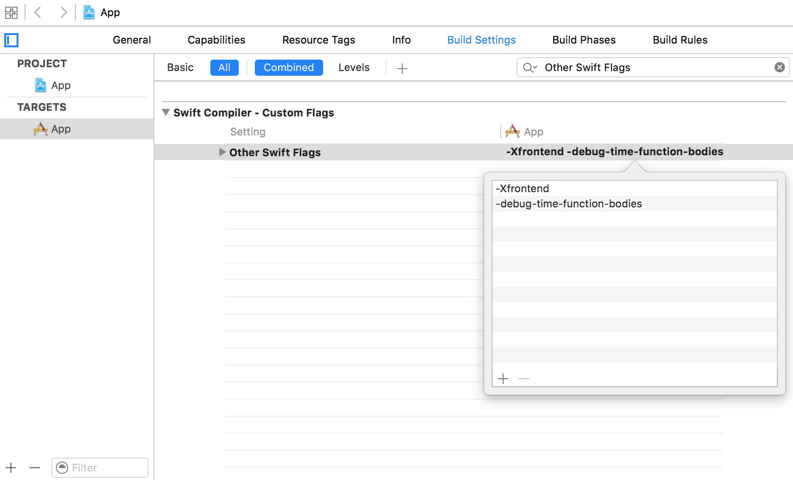
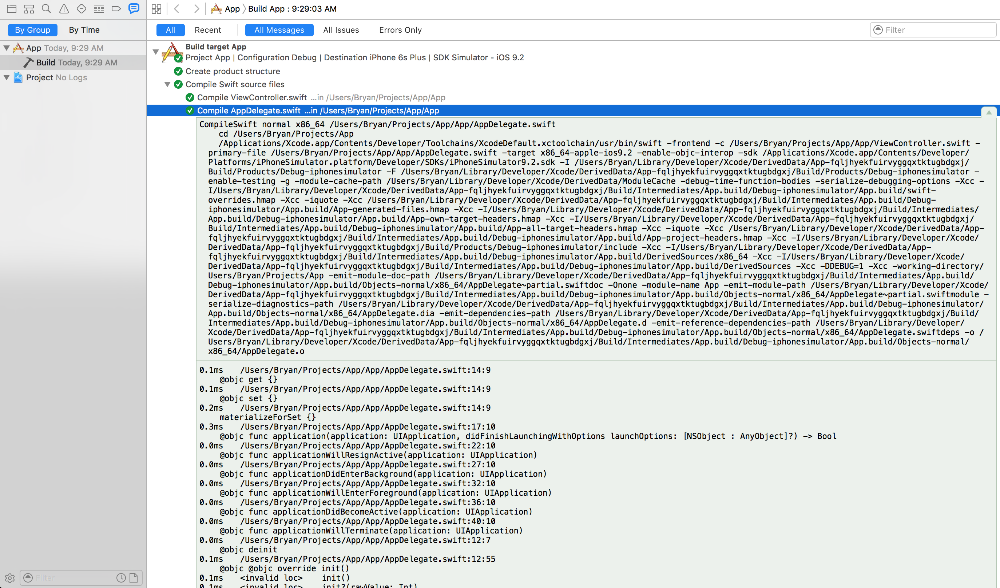
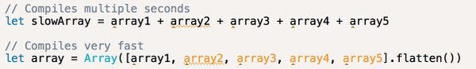

### 命令行

Swift 项目编译越来越慢？ 一行命令让你知道所有 Swift 文件的编译时间，在你的工程目录下执行一下命令行：
   
    xcodebuild -workspace App.xcworkspace -scheme App clean build OTHER_SWIFT_FLAGS="-Xfrontend -debug-time-function-bodies" | grep .[0-9]ms | grep -v ^0.[0-9]ms | sort -nr > culprits.txt
    
如果没有 workspace，只有 .xcodeproj 文件，请执行以下命令：

    xcodebuild -project App. xcodeproj -scheme App clean build OTHER_SWIFT_FLAGS="-Xfrontend -debug-time-function-bodies" | grep .[0-9]ms | grep -v ^0.[0-9]ms | sort -nr > culprits.txt
    
两行命令的意思都是一样的:配置 Build Setting 里 OTHER SWIFT FLAGS 为 “ -Xfrontend  -debug-time-function-bodies ” ， Clean and Build 工程，将运行时间大于 0ms 的文件 按时间排序 输出到 culprits.txt 文件。

### 配置 Xcode

当然，你也可以通过配置 Xcode 来获得编译时间，在Build Setting 里 OTHER SWIFT FLAGS 为 “ -Xfrontend  -debug-time-function-bodies ”

在 Report navigator 里，点击文件 ，右键 ，选择  **expand all transcripts**, 查看每个 Swift 文件的运行时间

### 加速你的 Swift 编译时间

找出耗时比较长的进行优化，下面就是一个需要注意的地方

参考链接：<http://irace.me/swift-profiling>
